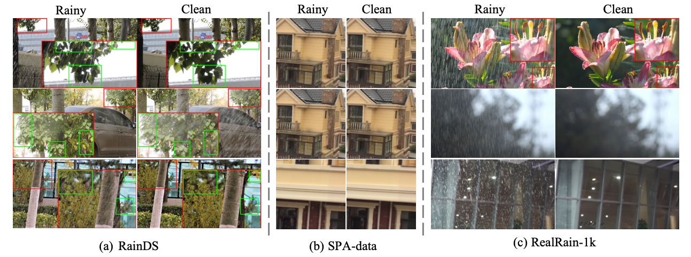
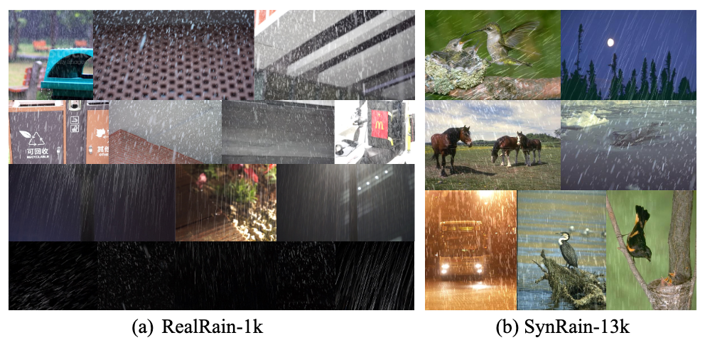

<h1 align="center">Toward Real-world Single Image Deraining: A New Benchmark and Beyond</h1>

<a href="http://arxiv.org/abs/2206.05514">.svg" ></a>

<h4 align="center">This is the official repository for RealRain-1k. The datasets will be released soon!</a>.</h4>
<h5 align="center">Wei Li*, Qiming Zhang*, Jing Zhang, Zhen Huang, Xinmei Tian, Dacheng Tao</em></h5>

  <a href="#introduction">Introduction</a> |
  <a href="#datasets">Datasets</a> |
  <a href="#results">Results</a>

## Introduction

Single image deraining (SID) in real scenarios attracts increasing attention in recent years. Due to the difficulty in obtaining real-world rainy/clean image pairs, previous real datasets suffer from low-resolution images, homogeneous rain streaks, limited background variation, and even misalignment of image pairs, resulting in incomprehensive evaluation of SID methods. To address these issues, we establish a new high-quality dataset named <strong>RealRain-1k</strong>, consisting of 1,120 high-resolution paired clean and rainy images with low- and high-density rain streaks, respectively. Images in RealRain-1k are automatically generated from a large number of real-world rainy video clips through a simple yet effective rain density-controllable filtering method, and have good properties of high image resolution, background diversity, rain streaks variety, and strict spatial alignment. RealRain-1k also provides abundant rain streak layers as a byproduct, enabling us to build a large-scale synthetic dataset named <strong>SynRain-13k</strong> by pasting the rain streak layers on abundant natural images. Based on them and existing datasets, we benchmark more than 10 representative SID methods on three tracks: (1) fully supervised learning on RealRain-1k, (2) domain generalization to real datasets, and (3) syn-to-real transfer learning. The experimental results (1) show the difference of representative methods in image restoration performance and model complexity, (2) validate the significance of the proposed datasets for model generalization, and (3) provide useful insights on the superiority of learning from diverse domains and shed lights on the future research on real-world SID.

## Datasets
A glance at other real rainy datasets and RealRain-1k

# Results
Benchmark results of supervised learning track

